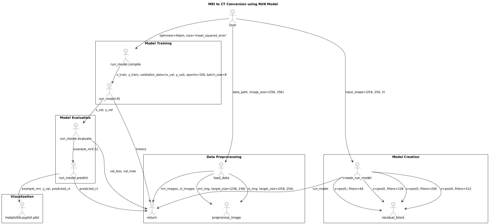

# MRI to CT Image Translation using Residual Learning-based U-Net (RUN)



## Overview

This project focuses on converting MRI images of the knee joint into corresponding CT images using a Residual Learning-based U-Net (RUN) model. The process involves data preprocessing, model building, training, and evaluation.

## Dataset

- **Images**: 200 pairs of MRI and CT images of the knee joint.
- **Task**: Train a model to translate MRI images into corresponding CT images.

## Libraries Used

- **TensorFlow/Keras**: For building and training the model.
- **NumPy**: For numerical operations.
- **OpenCV**: For image processing.
- **Scikit-learn**: For splitting the dataset.

```python

# Importing libraries
import tensorflow as tf
from tensorflow.keras.layers import Input, Conv2D, MaxPooling2D, UpSampling2D, concatenate, BatchNormalization, Activation, Add
from tensorflow.keras.models import Model
from tensorflow.keras.optimizers import Adam
import numpy as np
import cv2
import os
from sklearn.model_selection import train_test_split

# Ensure compatibility with different TensorFlow versions
tf.compat.v1.disable_eager_execution()

```

## Data Preprocessing

The data preprocessing step includes loading the images, resizing them to a consistent size (256x256 pixels), normalizing pixel values, and splitting the dataset into training and validation sets.

```python

def load_data(data_path, image_size=(256, 256)):
    mri_images = []
    ct_images = []
    for i in range(200):
        mri_path = os.path.join(data_path, f"MRI/{i}.jpg")  # Replace with your actual image path
        ct_path = os.path.join(data_path, f"CT/{i}.jpg")

        mri_img = cv2.imread(mri_path)
        ct_img = cv2.imread(ct_path)

        mri_img = preprocess_image(mri_img, image_size)
        ct_img = preprocess_image(ct_img, image_size)

        mri_images.append(mri_img)
        ct_images.append(ct_img)

    return np.array(mri_images), np.array(ct_images)

def preprocess_image(img, target_size):
    img = cv2.resize(img, target_size)
    img = img / 255.0  # Normalize pixel values to [0, 1]
    return img

data_path = "path_to_your_data"  # Replace with your data path
mri_images, ct_images = load_data(data_path)

x_train, x_val, y_train, y_val = train_test_split(mri_images, ct_images, test_size=0.2, random_state=42)

```

## Building the RUN Model

Now, let's create the Residual Learning-based U-Net (RUN) model. We'll define a function to build the model using convolutional layers, residual blocks, and upsampling layers.

```python

# Function to create a residual block
def residual_block(x, filters, kernel_size=3):
    shortcut = x  # Store the input for the shortcut connection

    # First convolutional layer
    x = Conv2D(filters, kernel_size, padding='same')(x)
    x = BatchNormalization()(x)
    x = Activation('relu')(x)

    # Second convolutional layer
    x = Conv2D(filters, kernel_size, padding='same')(x)
    x = BatchNormalization()(x)

    # Add the shortcut (residual connection)
    x = Add()([x, shortcut])
    x = Activation('relu')(x)

    return x

# Function to build the RUN model
def create_run_model(input_shape=(256, 256, 3)):
    inputs = Input(input_shape)

    # Encoder path (downsampling)
    conv1 = Conv2D(64, 7, padding='same')(inputs)
    conv1 = BatchNormalization()(conv1)
    conv1 = Activation('relu')(conv1)
    pool1 = MaxPooling2D(pool_size=(2, 2))(conv1)

    # Residual blocks
    res1 = residual_block(pool1, 64)
    pool2 = MaxPooling2D(pool_size=(2, 2))(res1)

    res2 = residual_block(pool2, 128)
    pool3 = MaxPooling2D(pool_size=(2, 2))(res2)

    res3 = residual_block(pool3, 256)
    pool4 = MaxPooling2D(pool_size=(2, 2))(res3)

    # Bridge
    res4 = residual_block(pool4, 512)

    # Decoder path (upsampling)
    up1 = UpSampling2D(size=(2, 2))(res4)
    up1 = concatenate([up1, res3], axis=-1)
    up1 = residual_block(up1, 256)

    up2 = UpSampling2D(size=(2, 2))(up1)
    up2 = concatenate([up2, res2], axis=-1)
    up2 = residual_block(up2, 128)

    up3 = UpSampling2D(size=(2, 2))(up2)
    up3 = concatenate([up3, res1], axis=-1)
    up3 = residual_block(up3, 64)

    # Output layer
    outputs = Conv2D(3, 1, activation='sigmoid')(up3)

    model = Model(inputs=inputs, outputs=outputs)
    return model

# Create the model
run_model = create_run_model()
run_model.summary()  # Display the model architecture

```

## Training the Model

Let's compile and train the RUN model using the training data. We'll use the Adam optimizer and Mean Squared Error (MSE) loss function. We'll also include a callback to save the best model during training.

```python

# Compile the model
run_model.compile(optimizer=Adam(learning_rate=0.001), loss='mean_squared_error', metrics=['mae'])

# Train the model
history = run_model.fit(
    x_train, y_train,
    epochs=100,
    batch_size=8,
    validation_data=(x_val, y_val),
    callbacks=[
        tf.keras.callbacks.ModelCheckpoint("best_model.h5", save_best_only=True, monitor="val_loss", mode="min"),
        tf.keras.callbacks.EarlyStopping(monitor="val_loss", patience=10, verbose=1)
    ]
)

```

## Evaluation

Finally, let's evaluate the model's performance on the validation set and test it on some example images.

```python

# Evaluate the model on the validation set
val_loss, val_mae = run_model.evaluate(x_val, y_val)
print(f"Validation Loss: {val_loss}")
print(f"Validation MAE: {val_mae}")

# Load the best model (if saved during training)
run_model.load_weights("best_model.h5")

# Test the model on some example images
example_mri = x_val[:5]  # Use the first 5 images from the validation set
predicted_ct = run_model.predict(example_mri)

# Visualize the results
import matplotlib.pyplot as plt

for i in range(5):
    plt.figure(figsize=(12, 4))
    plt.subplot(1, 3, 1)
    plt.title("Original MRI")
    plt.imshow(example_mri[i])

    plt.subplot(1, 3, 2)
    plt.title("Original CT")
    plt.imshow(y_val[i])

    plt.subplot(1, 3, 3)
    plt.title("Predicted CT")
    plt.imshow(predicted_ct[i])

    plt.show()

```

## Additional Considerations

- Data Augmentation: You can apply data augmentation techniques to increase the diversity of your training data.

- Hyperparameter Tuning: Experiment with different hyperparameters like learning rate, batch size, and number of residual blocks.

- Evaluation Metrics: Consider using additional metrics like Peak Signal-to-Noise Ratio (PSNR) and Structural Similarity Index (SSIM) to evaluate the quality of the predicted CT images.
